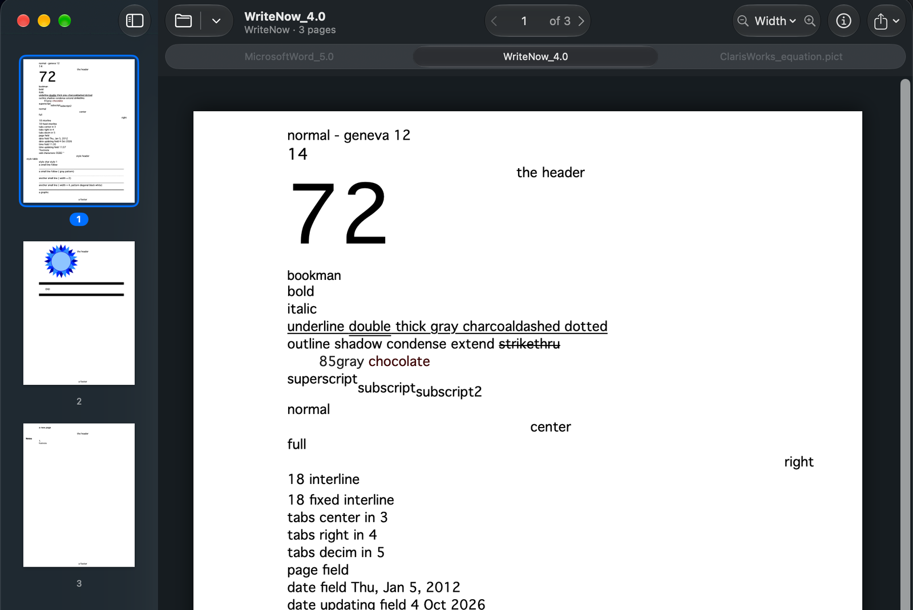
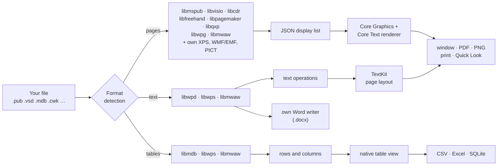
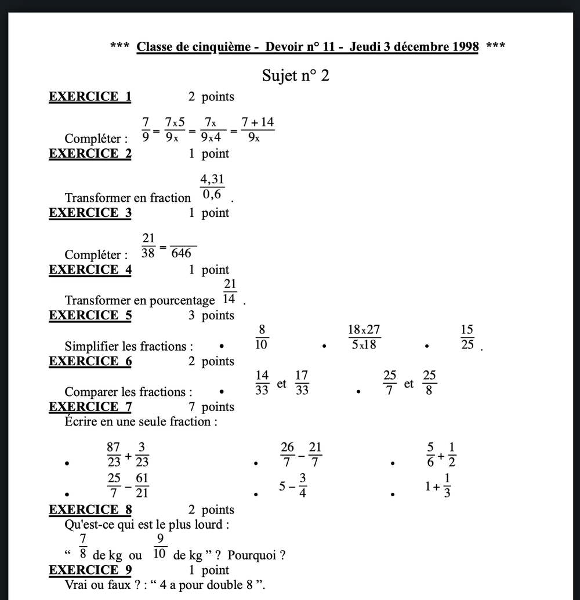
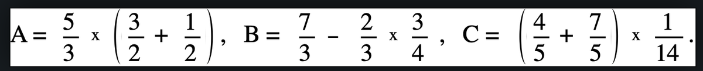

  

<h1 align="center">UltraReader</h1>

<h3 align="center">Opens the files your Mac can't.</h3>

  Publisher, Visio, Access, CorelDRAW, WordPerfect, ClarisWorks, Lotus 1-2-3, MacWrite, PICT — 
  <b>70+ formats</b> from Windows, DOS and the classic Mac, read natively and completely offline.

  <a href="https://github.com/akeisoft/UltraReader/releases/download/1.4/UltraReader-1.4.dmg"><b>⬇&nbsp;&nbsp;Download for Mac</b></a>
  &nbsp;&nbsp;·&nbsp;&nbsp;
  <a href="https://github.com/akeisoft/UltraReader/releases">All releases</a>
  &nbsp;&nbsp;·&nbsp;&nbsp;
  <a href="https://akeisoft.com">akeisoft.com</a>

  
  
  
  
  
  
  

  

---

Somewhere on a disk, in a mail attachment or in an archive there is a `.pub` newsletter, a `.vsd` diagram, an Access database, a WordPerfect contract or a ClarisWorks report from 1997 — and nothing on the Mac opens it. **UltraReader** does: double-click, and the document appears with its pages, fonts, pictures and tables, the way its author saw it. Then save it as PDF, Word or Excel and it is yours again.

<table>
  <tr>
    <td align="center" width="25%">📂 <b>70+ formats</b> Publishing, drawings, text, databases, spreadsheets, presentations and pictures — from 1984 to today.</td>
    <td align="center" width="25%">🎯 <b>Faithful pages</b> Its own Core Graphics renderer: real fonts, exact sizes, gradients, patterns, arrowheads. Text stays text.</td>
    <td align="center" width="25%">🔁 <b>Export it</b> PDF, PNG, Word (.docx), CSV, Excel (.xlsx), SQLite. Whole folders at once with batch conversion.</td>
    <td align="center" width="25%">🔒 <b>Private</b> Sandboxed, no network access at all. Your files are read on your Mac and never leave it.</td>
  </tr>
</table>

## 📚 What it opens

<table>
  <tr>
    <td align="center" width="20%">🖨️ <b>Publisher</b> <code>.pub</code></td>
    <td align="center" width="20%">📐 <b>Visio</b> <code>.vsd .vsdx .vdx</code></td>
    <td align="center" width="20%">🗄️ <b>Access</b> <code>.mdb .accdb</code></td>
    <td align="center" width="20%">🎨 <b>CorelDRAW</b> <code>.cdr .cmx</code></td>
    <td align="center" width="20%">📄 <b>XPS</b> <code>.xps .oxps</code></td>
  </tr>
  <tr>
    <td align="center">✒️ <b>FreeHand</b> <code>.fh3 … .fh11</code></td>
    <td align="center">📰 <b>PageMaker</b> <code>.pmd .pm6 .p65</code></td>
    <td align="center">🗞️ <b>QuarkXPress</b> <code>.qxd .qxt</code></td>
    <td align="center">📝 <b>WordPerfect</b> <code>.wpd .wp5 .wp6</code></td>
    <td align="center">🧰 <b>Microsoft Works</b> <code>.wps .wks .wdb</code></td>
  </tr>
  <tr>
    <td align="center">✍️ <b>Write · Word for DOS</b> <code>.wri .doc</code></td>
    <td align="center">📊 <b>Lotus 1-2-3</b> <code>.wk1 .wk3 .wk4 .123</code></td>
    <td align="center">📈 <b>Quattro Pro</b> <code>.wq1 .wb1 .qpw</code></td>
    <td align="center">🍎 <b>ClarisWorks · AppleWorks</b> <code>.cwk</code></td>
    <td align="center">🖋️ <b>MacWrite · Word for Mac</b> no extension needed</td>
  </tr>
  <tr>
    <td align="center">🖌️ <b>MacDraw · MacPaint</b> no extension needed</td>
    <td align="center">🎞️ <b>PowerPoint 2–7</b> <code>.ppt</code></td>
    <td align="center">🖼️ <b>Apple PICT</b> <code>.pict .pct</code></td>
    <td align="center">🪟 <b>Windows Metafile</b> <code>.wmf .emf</code></td>
    <td align="center">📦 <b>BinHex archives</b> <code>.hqx</code></td>
  </tr>
</table>

74 file extensions are registered with macOS. Old Mac files often have no extension at all — UltraReader recognises them by their contents.

### 🖨️ Publishing and drawing

| Format | Extensions | Read by |
|:--|:--|:--|
| Microsoft Publisher | `.pub` | libmspub |
| Microsoft Visio — binary, XML and Office Open XML | `.vsd` `.vss` `.vst` · `.vdx` `.vsx` `.vtx` · `.vsdx` `.vsdm` `.vstx` `.vstm` `.vssx` `.vssm` | libvisio |
| CorelDRAW and Corel Presentation Exchange | `.cdr` `.cdt` `.ccx` · `.cmx` | libcdr |
| FreeHand 3–11 | `.fh` `.fh3` `.fh4` `.fh5` `.fh7` `.fh8` `.fh9` `.fh10` `.fh11` | libfreehand |
| PageMaker 6–7 | `.pmd` `.pm6` `.p65` `.pt6` `.t65` | libpagemaker |
| QuarkXPress 3–4 | `.qxd` `.qxt` | libqxp |
| XPS and OpenXPS | `.xps` `.oxps` | UltraReader's own reader |
| WordPerfect Graphics 1–2 | `.wpg` | libwpg |

### 📝 Text documents

| Format | Extensions | Read by |
|:--|:--|:--|
| WordPerfect (DOS and Windows) | `.wpd` `.wp` `.wp4` `.wp5` `.wp6` `.wpt` | libwpd |
| Microsoft Works word processor | `.wps` | libwps |
| Microsoft Write | `.wri` | libwps |
| Microsoft Word for DOS | `.doc` | libwps |
| Pocket Word | `.psw` `.pwd` | libwps |

Text documents are laid out into real pages: page size and margins, headers and footers with page numbers, tables with merged cells, borders and shading, lists, tab stops, footnotes, pictures — and every one of them can be saved as a **Word document**.

### 🗄️ Databases and spreadsheets

| Format | Extensions | Read by |
|:--|:--|:--|
| Microsoft Access 97 – 365 (Jet 3, Jet 4, ACE) | `.mdb` `.mde` `.accdb` `.accde` | mdbtools (libmdb) |
| Lotus 1-2-3 and Symphony | `.wk1` `.wk3` `.wk4` `.123` | libwps |
| Quattro Pro | `.wq1` `.wq2` `.wb1` `.wb2` `.wb3` `.qpw` | libwps |
| Microsoft Works spreadsheets and databases | `.wks` `.wdb` | libwps |
| Multiplan | — | libwps |
| ClarisWorks / AppleWorks spreadsheets and databases, BeagleWorks, Claris Resolve, Works for Mac, Wingz, Jazz Lotus, Multiplan for Mac, RagTime | `.cwk` or none | libmwaw |

Tables open in a native table window: search, sort (numbers as numbers), copy with <kbd>⌘C</kbd>, double-click a row to see the whole record — and export to **CSV**, an **Excel workbook** (one sheet per table) or a **SQLite** database.

### 🍎 Classic Mac

ClarisWorks and AppleWorks — text, drawing, paint, spreadsheet and database — and the classics of System 6 to Mac OS 9, through libmwaw. Files without an extension and BinHex archives (`.hqx`) are recognised by their contents.

<b>All 49 classic Mac programs UltraReader recognises</b>

 

| | | | |
|:--|:--|:--|:--|
| Acta | Apple PICT | BeagleWorks | Canvas |
| Claris Resolve | ClarisDraw | ClarisWorks / AppleWorks | Corel Painter |
| Cricket Draw | DocMaker | Drawing Table | eDOC |
| FreeHand 1–2 (Mac) | FullPaint | FullWrite | GreatWorks |
| HanMac Word | Jazz Lotus | LightWayText | MacDoc |
| MacDraft | MacDraw | MacDraw II / Pro | MacPaint |
| MacWrite | MacWrite II / Pro | Mariner Write | MaxWrite |
| Microsoft Word for Mac 1–5 | Microsoft Works for Mac | MindWrite | More |
| MouseWrite | Nisus Writer | PixelPaint | PowerPoint for Mac 1–4 |
| RagTime | Ready,Set,Go! | Scoop | Script Writer |
| SpringBoard Publisher | Student Writing Center | SuperPaint | TeachText / SimpleText |
| Tex-Edit | WordMaker | WriteNow | WriterPlus |
| Z-Write | | | |

### 🎞️ Presentations and pictures

| Format | Extensions | Read by |
|:--|:--|:--|
| PowerPoint 2–7 and PowerPoint for Mac 1–4 | `.ppt` | libmwaw — one slide per page |
| Apple PICT 1 and 2 | `.pict` `.pct` | UltraReader's own QuickDraw player |
| Windows Metafile and Enhanced Metafile | `.wmf` `.emf` | UltraReader's own GDI renderer |

UltraReader is the default app only for formats the Mac has nothing else for. For `.doc` and `.ppt` it stays an *Open With* choice, so modern Word and PowerPoint files keep opening in Pages and Keynote.

## ✨ Features

| | |
|:--|:--|
| 📖&nbsp;**Reading** | Page thumbnails with numbers, continuous scrolling on the Mac's desk background, fit width / whole page / any zoom from 25 to 800 %, page field and arrows, document tabs |
| ℹ️&nbsp;**Document info** | Format, pages, page size in millimetres and inches, file size, title, author and dates — and *Show in Finder* |
| 🔁&nbsp;**Export** | PDF (vector, text selectable and searchable), PNG of the page at 216 dpi, Word (.docx) for text documents, CSV / Excel / SQLite for tables, Print, Share |
| 🗂️&nbsp;**Batch conversion** | Drop files or whole folders: every document becomes a PDF — or a Word document — in the folder you choose |
| 👁️&nbsp;**Quick Look** | Press <kbd>Space</kbd> in Finder: pages for documents, the list of tables and the first rows for databases and spreadsheets |
| 🔤&nbsp;**Cyrillic repair** | Publisher files whose Cyrillic text was stored as Windows-1252 are detected and shown in Windows-1251; old Access 97 files can be read in any code page |
| 🏠&nbsp;**Welcome window** | Recent documents with search, drag-and-drop, and a full *What Can It Open?* reference |

## ⌨️ Keyboard

| Action | Keys |
|:--|:--|
| Actual size · Fit page · Fit width | <kbd>⌘0</kbd> · <kbd>⌘9</kbd> · <kbd>⌘8</kbd> |
| Zoom in · Zoom out | <kbd>⌘+</kbd> · <kbd>⌘−</kbd> |
| Previous · Next page | <kbd>⌥⌘↑</kbd> · <kbd>⌥⌘↓</kbd> |
| Export as PDF · Export as Word | <kbd>⌘E</kbd> · <kbd>⌥⌘E</kbd> |
| Batch convert | <kbd>⇧⌘B</kbd> |
| Print | <kbd>⌘P</kbd> |
| Welcome window | <kbd>⇧⌘1</kbd> |
| Copy table rows | <kbd>⌘C</kbd> |

## 🔬 Under the hood

UltraReader is a native SwiftUI and AppKit app on top of a C++ core: ten document engines of the [Document Liberation Project](https://www.documentliberation.org) — the same engines LibreOffice uses for these formats — on their common framework librevenge, mdbtools for Access, and five components written for UltraReader itself.

**A display list instead of SVG.** The engines report every drawing call — paths, fills, text runs, images — through librevenge's drawing interface. UltraReader records those calls as a display list and draws it with Core Graphics and Core Text itself. Fonts, sizes and line breaks come out exactly, text stays real text in exported PDFs, and the same pages feed the window, thumbnails, PDF, PNG, printing and Quick Look.

**Written for UltraReader:**

| Component | What it does |
|:--|:--|
| 🖼️&nbsp;**QuickDraw PICT player** | Plays PICT 1 and 2: lines, shapes, arcs, polygons, regions, patterns, RGB colour, text with Mac fonts and MacRoman, the **Symbol font mapped to Unicode** math (π, √, −, ≤, ∑…), 1/2/4/8/16/32-bit bitmaps with PackBits, QuickTime JPEG and PNG. Draws all **130 of 130** pictures in the classic Mac test documents — the equations of Word 5 for Mac and ClarisWorks included |
| 🪟&nbsp;**WMF / EMF renderer** | Plays the Windows GDI records found inside Publisher, Visio, Word and Works files: mapping modes, world transforms, pens, brushes, paths, text with code pages and escapement, DIB bitmaps, clipping |
| 📄&nbsp;**XPS reader** | FixedDocument packages: canvases, path geometry with arcs, solid, linear, radial and image brushes, glyph runs by index — with **embedded obfuscated fonts** decoded and used for this document only |
| 📝&nbsp;**Word writer** | Text documents to Office Open XML: sections, headers and footers with page fields, tables with horizontal and vertical merges, borders and shading, pictures (vector pictures are rasterised at 288 dpi so Pages shows them), comments, metadata |
| 🗄️&nbsp;**Table bridge** | Access through libmdb with its own date decoding for dates libmdb rejects (before 1899 and after 4637); spreadsheets through libwps and libmwaw with typed columns; native CSV, XLSX and SQLite writers |

<table>
  <tr>
    <td width="50%"></td>
    <td width="50%">
      <b>Microsoft Word 5 for Mac, 1998.</b>  
      Every fraction on this page is a QuickDraw picture made by the equation editor, written in the Symbol font. macOS no longer reads PICT; UltraReader plays it itself, maps Symbol to Unicode and draws it as vectors — sharp at any zoom and in the PDF.  
      
      A ClarisWorks equation saved as a standalone <code>.pict</code> file.
    </td>
  </tr>
</table>

**Built and checked like this:**

- **582 engine sources** compiled into one universal static library (arm64 + x86_64) by a reproducible build script with pinned versions and SHA-256 checksums.
- **56 automated engine checks** on real documents, metafiles, databases, spreadsheets and Word exports.
- **AddressSanitizer and UndefinedBehaviorSanitizer** over every sample, every export and **1,400+ truncated and corrupted files**: zero reports, no crashes, no hangs.
- **No ICU:** a 250-line replacement on top of iconv handles the engines' encoding needs.
- **LGPL done right:** libmdb ships as a separate `libmdb.3.dylib` that can be replaced.

## 🔒 Privacy and security

- **No network access.** The app has no network entitlement; donate links open in your browser.
- **App Sandbox.** UltraReader reads only the files you open and writes only where you save.
- **Hardened Runtime, Developer ID, notarized by Apple.**
- **Read-only.** Your original files are never modified.

## ⬇️ Install

1. Download **[UltraReader.dmg](https://github.com/akeisoft/UltraReader/releases/download/1.4/UltraReader-1.4.dmg)**.
2. Open it and drag **UltraReader** onto **Applications**.
3. Launch it — the welcome window shows recent documents and everything it opens.

**Requirements:** macOS 14 Sonoma or later, Apple Silicon or Intel.

## ❓ FAQ

<b>Can I edit the documents?</b>

 
Not in their original formats: the open-source engines can read them but not write them — even LibreOffice cannot save to Publisher or CorelDRAW. Export instead — text documents to Word, tables to Excel or SQLite, anything to PDF — and edit there.

<b>A file has no extension. Will it open?</b>

 
Yes. Choose it in the Open panel or drop it on the window: UltraReader recognises the format from the contents, which is how classic Mac files usually come.

<b>Spreadsheet formulas show numbers, not formulas.</b>

 
UltraReader shows the results the program saved last time; formulas are not recalculated.

<b>What doesn't open?</b>

 
Password-protected files, QuarkXPress 5 and later, and modern Office files (.docx, .xlsx, .pptx — Pages, Numbers and Keynote open those). For DjVu books there is <a href="https://github.com/akeisoft/DjVuReader">DjVu Reader</a>.

## ❤️ Support

UltraReader is free. If it opened something important for you, you can support the development — the ♥ button at the bottom of the sidebar shows both ways:

- **Card or PayPal** — any amount on [itch.io](https://akeisoft.itch.io/mac64)
- **USDT (TRC20 only)** — `TXxtzd4dRVkVWJ4D9HNazGEWCxPZqZn3U4`

## 📜 Licenses

UltraReader is free to use. © 2026 AKEISOFT. It is built on open-source engines, used unmodified:

| Component | Version | License | Source |
|:--|:--|:--|:--|
| librevenge | 0.0.5 | MPL 2.0 | [dev-www.libreoffice.org/src](https://dev-www.libreoffice.org/src/) |
| libmspub · libvisio | 0.1.4 · 0.1.7 | MPL 2.0 | [dev-www.libreoffice.org/src](https://dev-www.libreoffice.org/src/) |
| libcdr · libfreehand · libpagemaker · libqxp | 0.1.9 · 0.1.3 · 0.0.4 · 0.0.3 | MPL 2.0 | [Document Liberation Project](https://www.documentliberation.org) |
| libwpd · libwpg · libwps · libmwaw | 0.10.3 · 0.3.4 · 0.4.14 · 0.3.23 | MPL 2.0 | [Document Liberation Project](https://www.documentliberation.org) |
| mdbtools (libmdb) | 1.0.1 | LGPL 2.1 — separate, replaceable `libmdb.3.dylib` | [github.com/mdbtools/mdbtools](https://github.com/mdbtools/mdbtools) |
| Little CMS | 2.17 | MIT | [github.com/mm2/Little-CMS](https://github.com/mm2/Little-CMS) |
| Boost (headers) | 1.86.0 | Boost Software License 1.0 | [boost.org](https://www.boost.org) |

Libraries offered under MPL 2.0 / LGPL 2.1 are used under MPL 2.0.

---

  
    © 2026 <a href="https://akeisoft.com">AKEISOFT</a> · More Mac apps:
    <a href="https://akeisoft.com/#mac64">MAC64</a> ·
    <a href="https://github.com/akeisoft/DjVuReader">DjVu Reader</a> ·
    <a href="https://github.com/akeisoft/GeoScreen64">GeoScreen64</a>
  

